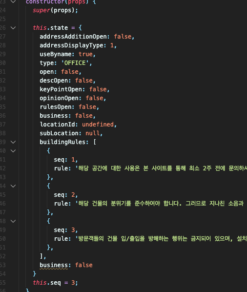
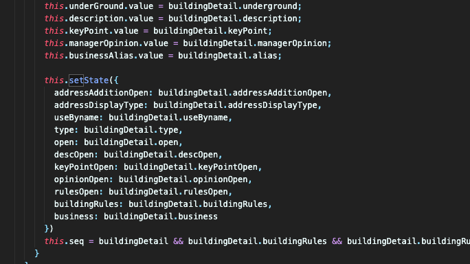
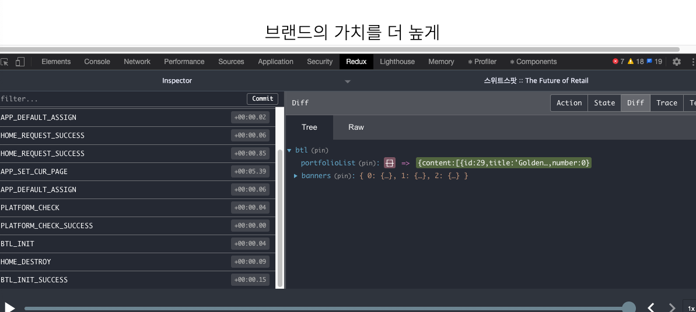
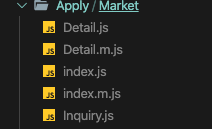

### 리덕스를 사용하여 좋았던 점(제 주관이 많이 포함되있을 수 있습니다)

다른 사람의 소스에 사용되는 state 를 확인하려면 해당 js 파일 위치를 찾고 -> 해당 소스 열고 -> constructor 확인

이 부분이 너무 귀찮다는 생각

덩치가 큰 form 이 있을 경우 view 쪽에 코드도 너무 길어진다

---
redux 를 사용하게 되면서 해당 모듈 혹은 컴포넌트에 필요한 데이터가 무엇인지 바로 확인 가능
또 redux dev tool 을 이용해서도 데이터 흐름 확인 가능

---
저희 프로젝트 기준으로 디자인이 반응형으로 디자인이 나오지 않아 개발자들끼리 논의 결과로 한페이지 PC, MOBILE 다른 컴포넌트로 두 벌 구성

해당 컴포넌트들을 state 로 개발하였을 경우 똑같은 state 코드를 두 번 넣어줘야 하고 값이 바뀔 경우 PC 컴포넌트가서 한번, 모바일 컴포넌트가서 한번 수정하였어야하는 불편함이 생길 수 있음

---
view 쪽에 조금이라도 코드를 주기 보기 편하다

---

### .